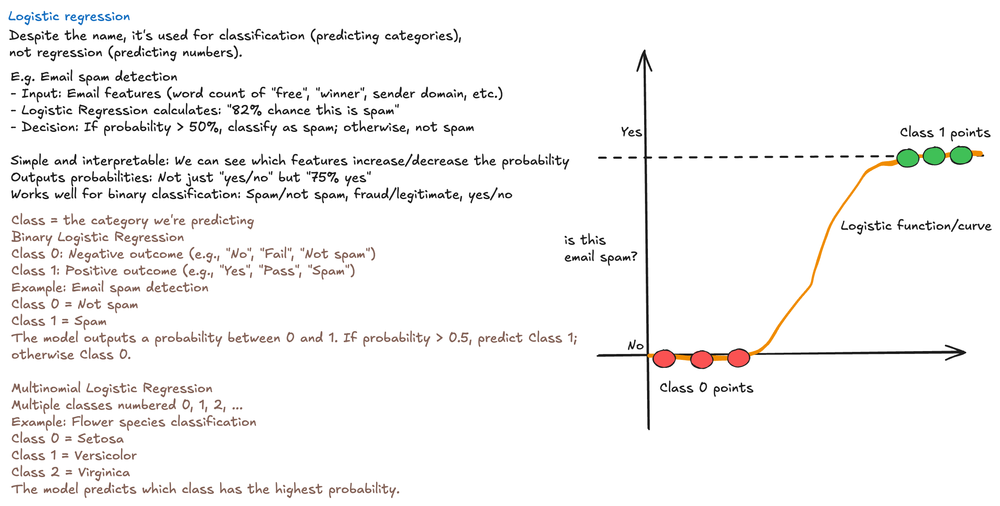
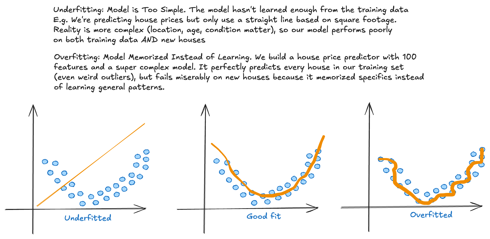

> running notes on the fundamentals of deep learning, MLOps, and the LLM Lifecycle. This file defaults to ML fundamentals.

---

---

**K-Means and KNN = Two Completely Different Algorithms (Despite Similar Names)**  
**K-Means = Unsupervised Clustering**  
**What it does:** Groups similar data points into K clusters automatically. No labels needed.  
**Real example:** We have 10,000 customer purchase records. Run K-Means with K=3, and it groups customers into 3 segments: "budget shoppers," "occasional buyers," and "premium customers". Without we telling it these categories exist.

**How it works:**  
1. Randomly place K "center points" (centroids)
2. Assign each data point to the nearest centroid
3. Move centroids to the average position of their assigned points
4. Repeat steps 2-3 until centroids stop moving

**When to use:** 
- Customer segmentation
- Image compression (grouping similar colors)
- Finding patterns in unlabeled data

**Key challenge:** We must choose K beforehand (how many clusters?).

**KNN (K-Nearest Neighbors) = Supervised Classification/Regression**  
**What it does:** Predicts a label by looking at the K closest labeled examples in our training data.  
**Real example:** We want to classify if an email is spam. KNN looks at the 5 most similar emails we've already labeled (based on word frequency, sender, etc.). If 4 out of 5 are spam, it predicts: spam.

**How it works:**
1. Store all training data
2. When a new point comes in, find the K nearest training examples (using distance, like Euclidean)
3. For classification: majority vote among those K neighbors
4. For regression: average of those K neighbors

**When to use:**
- Simple classification tasks (spam detection, recommendation systems)
- When we have labeled training data
- Small to medium datasets (slow on large data)

**Key challenge:** Computationally expensive. Must calculate distance to all training points for each prediction.

**Key Differences:**

| | K-Means | KNN |
|---|---|---|
| **Type** | Unsupervised (clustering) | Supervised (classification/regression) |
| **Needs labels?** | No | Yes |
| **What K means** | Number of clusters | Number of neighbors to check |
| **Goal** | Group similar data | Predict label of new data |
| **Example** | "Find 3 customer segments" | "Is this email spam based on similar emails?" |